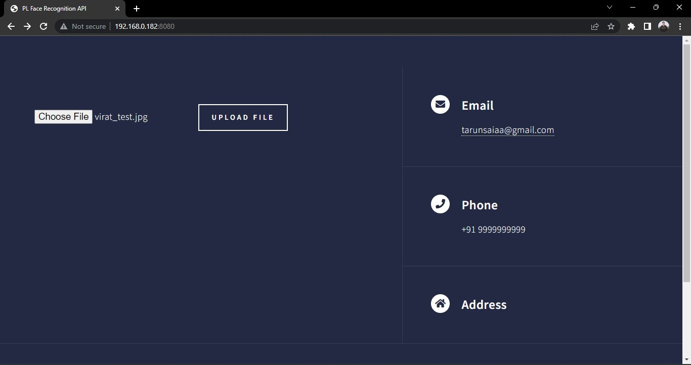
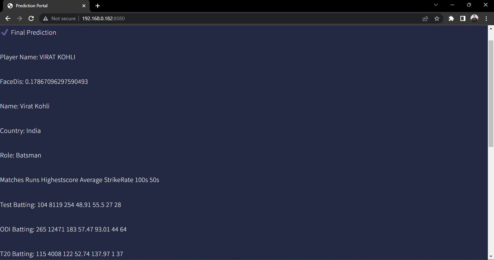

# Face-Recognition-Cricket-Players-API
An unofficial API  to search players using the player's reference image and get the player career stats data
<h2>Setup Details</h2>
Follow the following instructions to run the application and start using the api in your local pc
<li>Clone the repository</li>
<li>Open the terminal, navigate to the folder where your clone of this repository is located and type:
  
  `$ pip install -r requirements.txt` </li>
<li>Use the scrape_photos.py script to scrape the player images and save them in a folder</li>
<li>Use the train.py scipt to train the model to identify the player faces and train the model</li>
<li> Type $ python main.py in the terminal and the script will run for as long as you let it </li>

<H2>Home Page</H2>
<ul>
  <li>Upload the photo of the Crcikcet Player photo whose stats you want to know; The Machine learning model will predict the player name from the feature vectors  (uploaded image) and fetch the player stats</li> 
  Example: Stats of Virat Kohli | upload the Clear photo of Virat Kohli
     
</ul>

<H2>Prediction Page</H2>
<ul>
  <li>The model has successfully predicted the Player and Fetched the Crcicket career stats data of the Player</li> 
  Example: It Successfully Predicted the Person present in the uploaded image and fetched the stats
     
</ul>
<H2>Project Progress</H2>
<ul>
  <li>successfully trained the model with players photos with an accuracy of 88%</li>
</ul>

###### (Credits: Used the face_recognition python library to train the model and predict the player in the image)
